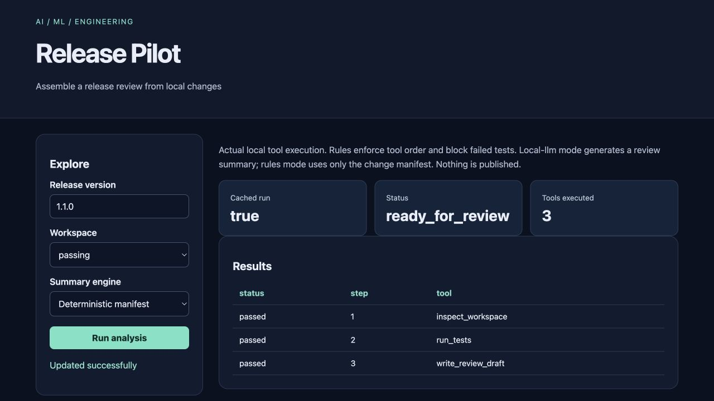

# Release Pilot

Assemble a release review from local changes for **small engineering teams**.

Original topic: **AI Workflow Agent** from [the source post](https://www.instagram.com/p/DdyMaogE4ud/).

> Local portfolio implementation developed with Codex assistance. Measured results and limitations are documented; no production adoption, revenue or hiring outcome is claimed.



## What works

- Tool-planning agent
- file checks
- tests
- diff summary
- resumable audit

[Example output](reports/example-output.json) · [Recorded checks](reports/test-results.txt) · [Learning and interview guide](LEARNING_GUIDE.md)

## Start

Python 3.12 is the validated Python runtime. Run commands from this repository directory. Windows users activate `.venv\Scripts\activate` instead of `source`.

```sh
python3.12 -m venv .venv
source .venv/bin/activate
python -m pip install -r requirements.txt
python app.py
```

Open **http://127.0.0.1:8080**. Keep the process running. Set `PORT` to use another port (Retention Studio uses `--port`). The Python development servers are intended for local demonstrations.

For actual local model inference, run `python download_model.py` once, then select the local language-model option. The default non-model mode is clearly labeled. Downloaded weights stay under ignored `var/model/`. No paid API is needed.

## Demonstration

Run the passing scenario and inspect tool observations. Run the failing scenario and see drafting stop. Select local-llm after downloading the model to generate an explicitly labeled summary, then repeat to see cached-run reuse.

## Architecture and decisions

Browser controls → validated Flask API → project analysis/workflow → results and export.

Stack: Python · Flask.

1. Use a policy-constrained state machine to select inspection, test and drafting tools.
2. Run only an allowlisted unittest command against bundled workspaces, with a timeout and bounded output.
3. Cache runs by content, version and engine; optional local model synthesis stays inside an unsent review draft.

## Verification

```sh
python -m pytest -q
```

See [VERIFICATION.md](VERIFICATION.md) for actual executed checks, setup verification, model/data results and any outstanding environment limitations. A workflow file alone is not evidence that CI passed.

## Data and attribution

Local sample release workspace. See [DATA_AND_SOURCES.md](DATA_AND_SOURCES.md) for provenance and usage notes. Original project code is MIT unless a preserved source file or dependency states otherwise. Model and third-party data licenses remain separate.

## Limitations and next improvement

Bundled example repositories only; it is not a general shell agent. Secret detection is illustrative, not comprehensive. The language model may write inaccurate summaries; test evidence and change manifests remain authoritative. No pushes, tags or external messages occur.

Suggested extension: Add a license-presence inspection tool and ensure its failure blocks draft creation.

## Honest portfolio use

This implementation and documentation were developed with substantial Codex assistance. Before presenting it, run the demonstration, explain the design choices, and complete the suggested independent modification. Do not describe generated code as work experience, an accepted upstream contribution, or a deployed production service.
